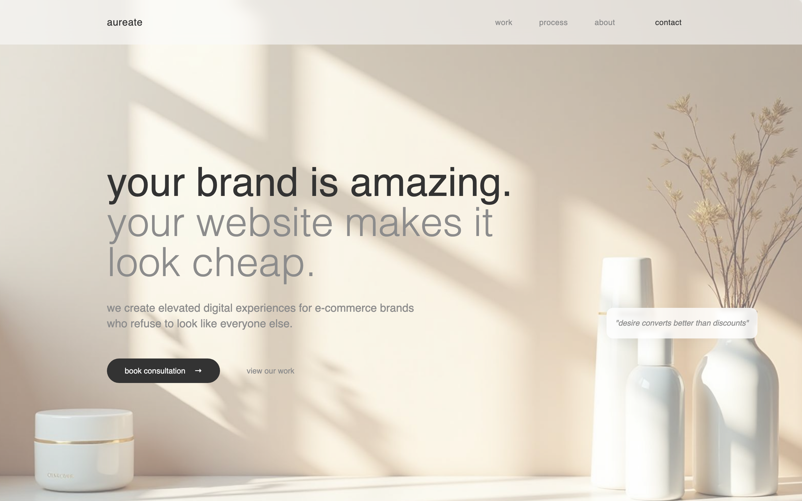
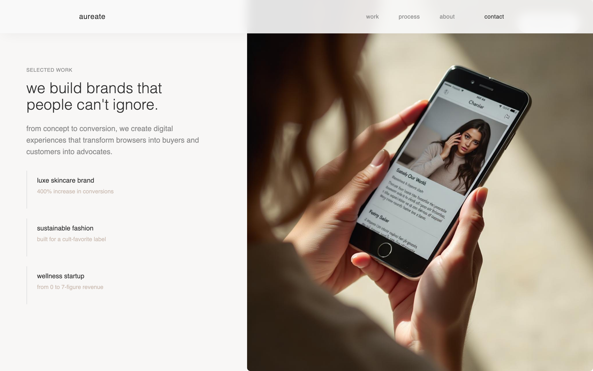

# aureate ✨

**elevated e-commerce design for gen z brands.**

Aureate is a single-page marketing site for a fictional creative studio — the kind
that builds digital storefronts for brands who would rather be *iconic* than
*generic*. It's a calm, editorial, scroll-driven experience: soft light,
lowercase confidence, and buttery smooth scrolling from the first fold to the
last call-to-action.

> *"desire converts better than discounts."*



---

## why it exists

Most agency sites shout. This one whispers — and that's the whole point. Aureate
is a design study in restraint: a warm neutral palette, generous whitespace, an
oversized display typeface, and micro-interactions that reward you for scrolling
rather than yelling for your attention. Think of it as a portfolio piece with
opinions.

## what's inside

- **buttery smooth scrolling** — powered by [Lenis](https://github.com/darkroomengineering/lenis), the whole page eases as you move.
- **scroll-triggered animations** — sections stagger into view with a custom `useScrollAnimation` hook, plus a gentle parallax on the hero.
- **a real narrative** — problem → editorial → selected work → approach → mission → fit → call to action. It reads like a pitch, not a template.
- **working navigation** — the nav, hero buttons, and footer all smooth-scroll to the right section (no dead `#` links here).
- **fully responsive** — a proper mobile menu, fluid type, and layouts that hold up from a 390px phone to a 1440px display.
- **an on-brand 404** — even the not-found page stays in character.
- **50+ accessible UI primitives** — built on [Radix UI](https://www.radix-ui.com/) and styled with Tailwind + shadcn conventions, ready for you to extend.



## the stack

| layer | tech |
|-------|------|
| framework | **React 18** + **TypeScript** |
| build tool | **Vite** (SWC) |
| styling | **Tailwind CSS** + custom design tokens |
| components | **Radix UI** primitives (shadcn-style) |
| smooth scroll | **Lenis** |
| routing | **React Router** |
| data/state | **TanStack Query** (wired up and ready) |

---

## getting started

You'll need **Node 18+** and npm. Then:

```bash
# 1. clone it
git clone https://github.com/waleedsworld/aureate.git
cd aureate

# 2. install the goodies
npm install

# 3. fire up the dev server
npm run dev
```

Now open **http://localhost:8080** and watch the light hit the bottles. 🌤️

### the scripts you'll actually use

| command | what it does |
|---------|--------------|
| `npm run dev` | start the dev server with hot reload |
| `npm run build` | build an optimized production bundle into `dist/` |
| `npm run preview` | preview that production build locally |
| `npm run lint` | run ESLint and keep things tidy |

## project structure

```
src/
├── components/         # section components (Hero, PortfolioPreview, CTA, …)
│   └── ui/             # 50+ Radix-based UI primitives
├── pages/              # Index (the landing page) + NotFound
├── hooks/              # useScrollAnimation, useParallax, use-mobile, …
├── lib/                # utils + the smooth-scroll helper
├── assets/             # hero + editorial imagery
├── App.tsx             # providers + router
└── main.tsx            # entry point
```

## making it yours

- **copy & story** live right inside each component under `src/components/` — start with `Hero.tsx` and `CTASection.tsx`.
- **the palette, radii, and fonts** are all design tokens in `src/index.css` and `tailwind.config.ts`. Tweak them once, and the whole site follows.
- **imagery** sits in `src/assets/` — swap in your own and the parallax comes along for the ride.

## live demo

Live demo — deploying soon.

## a note on the brand

*Aureate* is an original, fictional studio concept created purely as a design and
front-end showcase. Any brands, metrics, or case studies mentioned on the page
are illustrative placeholders, not real clients or claims.

---

made with a lot of whitespace and a little swagger.
